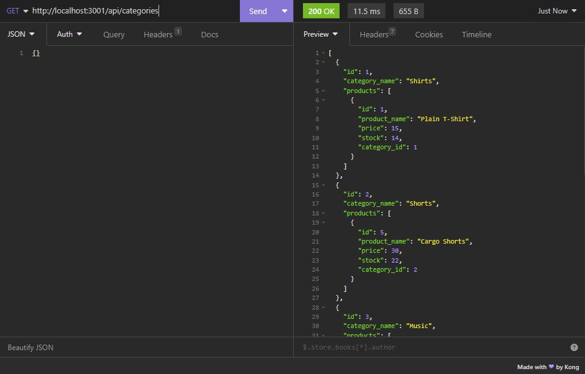

# Back End E-Commerce 

## Description

This page will serve as an e-commerce site.

## Table of contents

-[Installation](#Installation)
-[Usage](#Usage)
-[Credits](#Credits)

## Installation

This page shows the coding repository: https://github.com/KobyS82/E-Commerce

## Usage

To view the back end, run the following commands; 
- npm i
- npm run seed
- node .\server.js

Then, you can run insomnia and test out all of the routes found in the /routes/api/ foulder.

 

## Credits

PiJei, for MySQL, https://stackoverflow.com/questions/8940230/how-to-run-sql-script-in-mysql

MySQL, for MySQL docs, https://dev.mysql.com/doc/mysql-getting-started/en/#mysql-getting-started-installing

